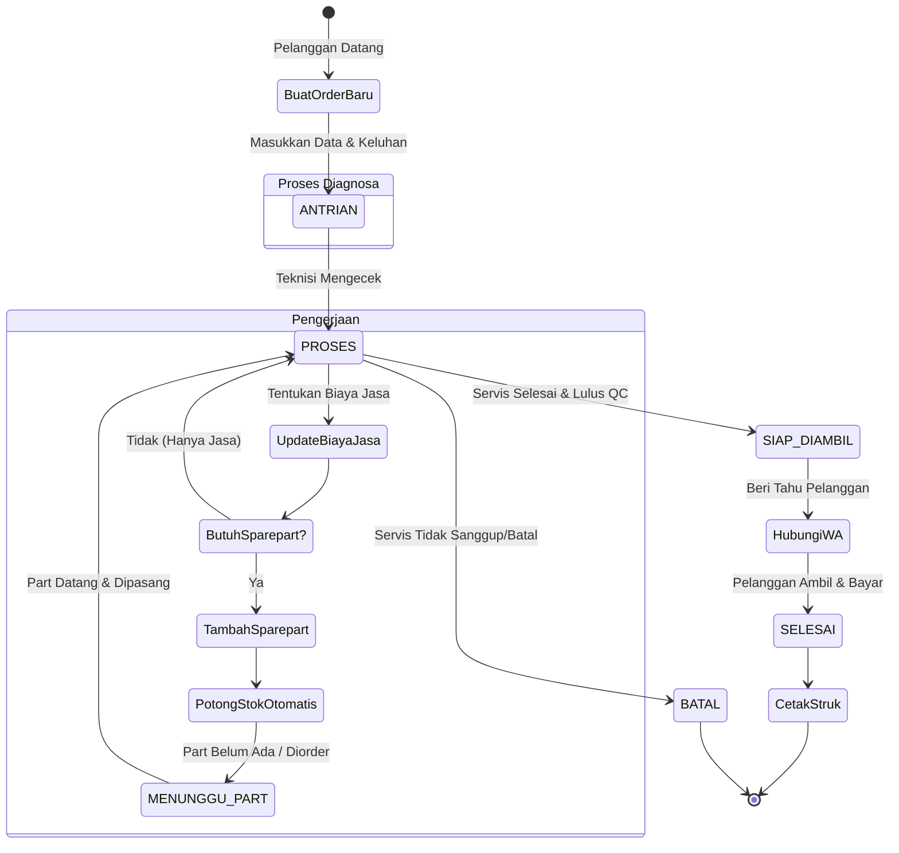
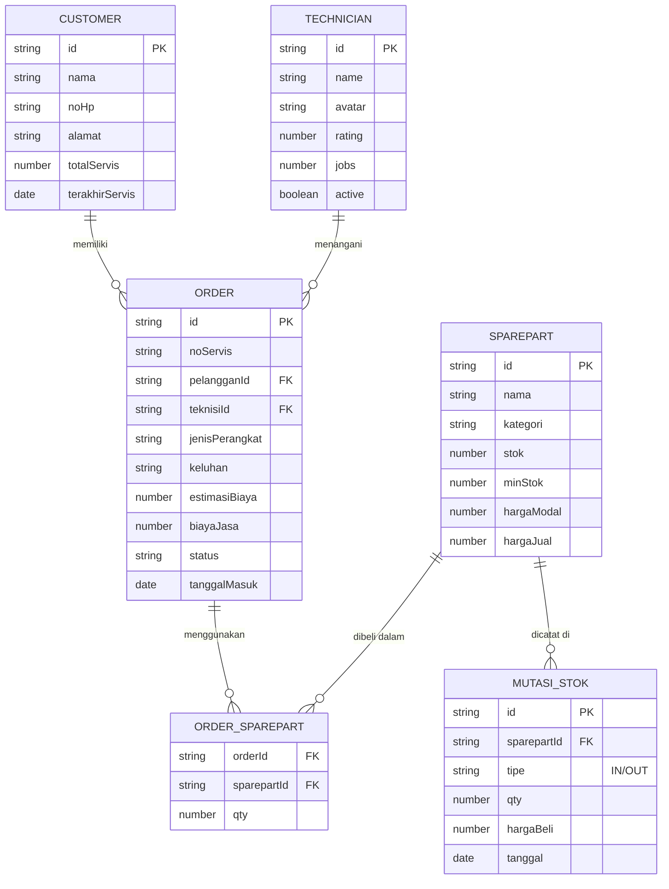

# Diagram Sistem (UML) ServisKu

Berikut adalah arsitektur logika dan alur sistem untuk memudahkan pemahaman teknis di masa depan.

## 1. Use Case Diagram
Diagram ini memetakan aktor (Admin/Pemilik) dan fitur-fitur yang bisa mereka akses dalam sistem.

```mermaid
usecaseDiagram
    actor Admin
    
    rectangle "Aplikasi ServisKu" {
        usecase "Login Sistem" as UC1
        usecase "Pantau Dashboard" as UC2
        usecase "Kelola Order Servis" as UC3
        usecase "Cetak Struk/Nota" as UC4
        usecase "Hubungi Pelanggan via WA" as UC5
        usecase "Kelola Stok & Sparepart" as UC6
        usecase "Mutasi Barang (Masuk/Keluar)" as UC7
        usecase "Lihat & Cetak Laporan" as UC8
        usecase "Kelola Pengaturan Toko" as UC9
    }
    
    Admin --> UC1
    Admin --> UC2
    Admin --> UC3
    Admin --> UC4
    Admin --> UC5
    Admin --> UC6
    Admin --> UC7
    Admin --> UC8
    Admin --> UC9
    
    UC4 ..> UC3 : extends
    UC5 ..> UC3 : extends
    UC7 ..> UC6 : extends
```

---

## 2. Activity Diagram: Alur Order Servis
Diagram ini menjelaskan *flow* dari pelanggan datang membawa perangkat rusak hingga selesai.



---

## 3. Entity Relationship Diagram (ERD) / Data Model
Struktur relasi data dalam Store / Database.


